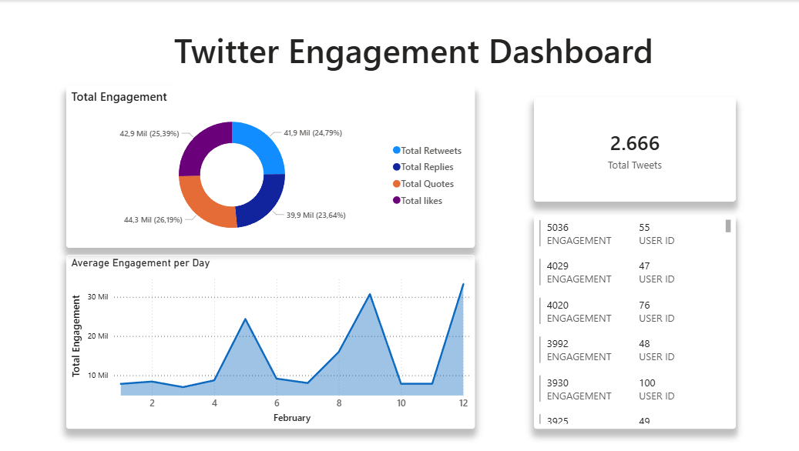
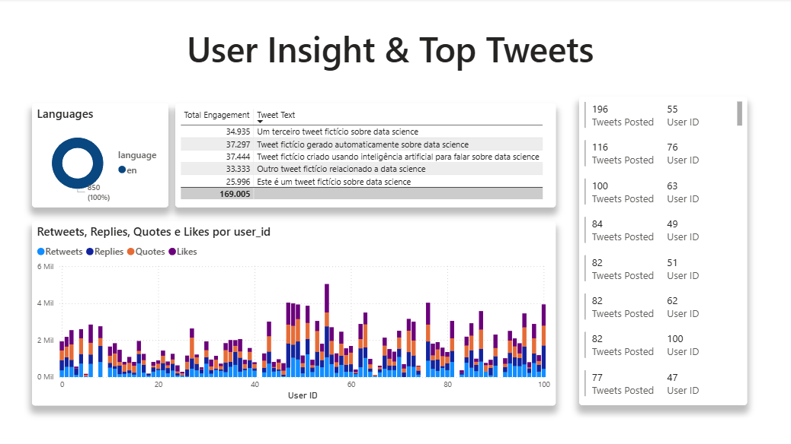

# 🐦 Twitter ETL Data Pipeline (Airflow + Spark + PostgreSQL + Power BI)

## 📌 Project Overview

This project is an end-to-end **Twitter ETL Data Pipeline** built with **Apache Airflow**, **Apache Spark**, and **PostgreSQL**, designed to extract tweet data from a **Fake Twitter API**, transform it through a **Medallion Architecture (Raw → Silver → Gold)**, and load the final curated dataset into a PostgreSQL database ready for analytics and visualization.

The pipeline runs fully containerized using **Docker Compose**, with Airflow orchestrating Spark jobs and Python tasks. The final dataset is stored both in **Parquet format** (Gold layer) and inside a dedicated PostgreSQL database, which can then be connected to **Power BI dashboards** for reporting.

---

## 🚀 Tech Stack

- Python  
- Apache Airflow  
- Apache Spark (PySpark)  
- PostgreSQL  
- Pandas  
- psycopg2  
- Docker / Docker Compose  
- Power BI  
- Fake Twitter API (HTTP Endpoint)

---

## 🎯 Main Features

✅ Automated daily ingestion using Airflow DAG scheduling  
✅ Custom **TwitterHook** (based on HttpHook) to connect to the API and paginate results  
✅ Custom **TwitterOperator** (based on BaseOperator) to extract tweets and save them as JSON  
✅ Raw layer stored as JSON files (backup + reproducibility)  
✅ Silver layer stored as partitioned Parquet (Spark transformation)  
✅ Gold layer enriched with engagement metrics (Spark transformation)  
✅ Partitioned storage by `created_date` in both Silver and Gold layers  
✅ Load Gold data into PostgreSQL for analytics  
✅ Dedicated PostgreSQL database for the project (separate from Airflow metadata DB)  
✅ Power BI dashboards connected directly to PostgreSQL  

---

## 🏗️ Pipeline Architecture (Medallion Architecture)

This project follows a **Medallion Architecture**:

### 🥉 Raw Layer (JSON)
- Data extracted daily from the Fake Twitter API
- Stored as JSON Lines files

Example:
data/raw/tweets_2026-02-13.json


### 🥈 Silver Layer (Parquet)
- Cleaned and structured dataset
- Public metrics expanded into proper columns
- Saved in Parquet format partitioned by date

Partition example:
data/silver/created_date=2026-02-12/


### 🥇 Gold Layer (Parquet + Analytics Ready)
- Business-ready dataset with aggregated engagement metrics
- Includes user-level and daily engagement averages
- Saved as partitioned Parquet and later loaded into PostgreSQL

Partition example:
data/gold/created_date=2026-02-12/

---

## ⚙️ ETL Modules (src/)

The main transformations are implemented in the `src/` folder.

### 📌 transformation.py (Raw → Silver)

This Spark job reads JSON data from the Raw layer and outputs structured Parquet files into Silver.

Main steps:
- Extract nested `public_metrics`
- Rename and clean columns
- Create `created_date` column
- Save as partitioned Parquet

Output:
- Silver Parquet Dataset

---

### 📌 transforming_gold.py (Silver → Gold)

This Spark job reads Parquet data from Silver and builds the Gold dataset by adding analytical metrics.

Main features:
- `engagement = likes + retweets + replies + quotes`
- `avg_eng_per_day` (average engagement grouped by day)
- `total_tweets` per user
- `avg_eng_per_user` per user
- Saves Gold dataset partitioned by `created_date`

Output:
- Gold Parquet Dataset

---

### 📌 to_sql.py (Gold → PostgreSQL)

This module loads the Gold dataset into PostgreSQL using Pandas + psycopg2.

Main steps:
- Reads Parquet from `/data/gold`
- Creates the table if it does not exist
- Inserts all records into PostgreSQL

Output:
- Table populated in PostgreSQL (`gold_twitter`)

---

## ⏳ Airflow DAG Orchestration

The ETL process is orchestrated using an Apache Airflow DAG:

📌 DAG Name: `tweets_pipeline`  
📌 Schedule: `@daily`  
📌 Start Date: `2026-02-01`  
📌 Catchup: `False`  
📌 Max Active Runs: `1`

### DAG Tasks Flow

The DAG executes the pipeline in the following order:

1. **Extract Tweets**
2. **Transform Raw → Silver (Spark)**
3. **Transform Silver → Gold (Spark)**
4. **Load Gold → PostgreSQL**

Pipeline execution:
extract_tweets >> twitter_transform >> twitter_gold >> gold_to_SQL

---

## 🔌 Custom Airflow Hook + Operator

### 📌 TwitterHook (airflow_utils/hook/twitterhook.py)

This custom hook extends Airflow's `HttpHook` and handles:

- API URL building with start/end timestamps
- HTTP request execution
- Pagination via `next_token`

It returns a list of JSON responses containing tweets.

---

### 📌 TwitterOperator (airflow_utils/operators/twitteroperator.py)

This custom operator extends Airflow's `BaseOperator` and handles:

- Using TwitterHook to fetch tweets
- Writing results into JSON Lines format
- Creating the output folder automatically

Output example:
data/raw/tweets_{{ ds }}.json

---

## 🐳 Dockerized Environment

The entire project is containerized using Docker Compose.

The environment includes:
- Airflow Webserver
- Airflow Scheduler
- Spark (for SparkSubmitOperator jobs)
- PostgreSQL (Airflow metadata DB)
- PostgreSQL dedicated database for analytics (**postgres-data**)

📌 Important detail:
This project uses a **second PostgreSQL instance** (or database container) on a different port to store the Gold analytics data.

---

## 📂 Project Structure
.
├── README.md
├── airflow_utils
│ ├── dags
│ │ └── etlDagTweets.py
│ ├── hook
│ │ └── twitterhook.py
│ ├── logs
│ └── operators
│ └── twitteroperator.py
├── data
│ ├── raw
│ │ └── tweets_YYYY-MM-DD.json
│ ├── silver
│ │ └── created_date=YYYY-MM-DD/
│ └── gold
│ └── created_date=YYYY-MM-DD/
├── docker
│ ├── Dockerfile
│ ├── docker-compose.yml
│ └── requirements.txt
├── sql
│ └── create_tables.sql
└── src
├── to_sql.py
├── transformation.py
└── transforming_gold.py

---

## 🗄️ Table Schema (PostgreSQL)

The Gold dataset is loaded into the following table:

📌 Table name: `gold_twitter`

```sql
CREATE TABLE IF NOT EXISTS gold_twitter (
    user_id BIGINT,
    thread_id BIGINT,
    tweet_id BIGINT,
    created_at TIMESTAMP,
    created_date DATE,
    tweet_text TEXT,
    likes INT,
    quotes INT,
    replies INT,
    retweets INT,
    engagement FLOAT,
    avg_eng_per_day FLOAT,
    total_tweets INT,
    avg_eng_per_user FLOAT,
    language VARCHAR(10),
    collected_at TIMESTAMP DEFAULT CURRENT_TIMESTAMP
);
📊 Metrics Generated in the Gold Layer

The Gold layer includes analytics-ready features:

engagement
Sum of likes, replies, retweets, and quotes

avg_eng_per_day
Daily average engagement across all tweets

total_tweets
Total tweets posted by each user in the dataset

avg_eng_per_user
Average engagement per user

📊 Power BI Dashboard

After the ETL pipeline loads the Gold dataset into PostgreSQL, the database can be connected to Power BI for visualization and reporting.
The dashboard can be refreshed to always retrieve the most updated data from the PostgreSQL Gold table.
Page 1 - Tweets Overview


Page 2 - Engagement Analytics
